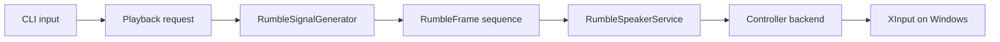

# Architecture

## High-level flow

## Why the code is split this way

The most important design choice is the seam between the pure logic and the hardware layer.

- `RumbleSignalGenerator` is pure logic. It can be tested on any platform.
- `RumbleSpeakerService` is orchestration. It coordinates playback, logging, and timing.
- `IControllerRumbleBackend` hides platform-specific controller access behind an interface.
- `WaveFileReader` is isolated so file parsing can be tested independently from playback.

## Why that matters

If the XInput calls were spread throughout the whole codebase, GitHub Actions could not exercise
the interesting logic unless a physical controller happened to be attached to the runner. By
isolating the hardware boundary, we can test almost everything that matters.
